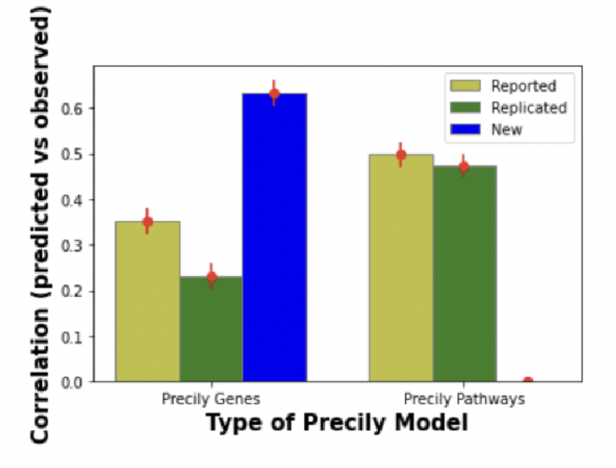

<h1>Cancer Drug Response</h1>

**What is this project about?**

In this project, I predicted cancer cell-line’s response to potential drug therapies based on gene expression levels. 

> See detailed findings in the **final_report.pdf** in this repo.

**What's the main contribution?**

 

I determined shortcomings in training pipeline in the current state-of-the art Precily model architecture proposed by Chawla et al in [Nature Communications](https://www.nature.com/articles/s41467-022-33291-z "The paper").

I built and trained a new deep-learning based pipeline that addressed the shortcomings, **achieving 63% correlation between predicted and observed drug sensitivity, 37% higher than the current state-of-the-art model**.

**What data sets are used?**

Cancer Cell Line Encyclopedia (CCLE) - Gene expression RNA-seq data 

Drug response data from GDSC 

